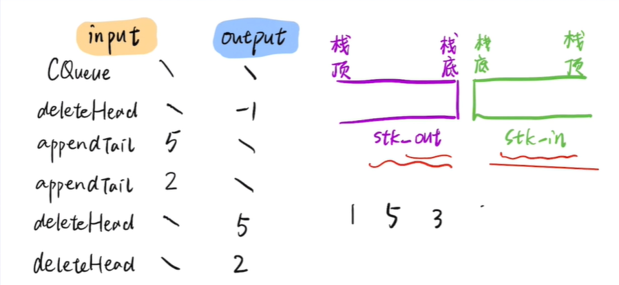

#### 题目说明
```
输入：
["CQueue","appendTail","deleteHead","deleteHead"]
[[],[3],[],[]]
输出：[null,null,3,-1]
```
- 输入的字符串代表操作：
    - CQueue：创建双栈队列 :对应的参数 [] 为空 ：函数的返回结果：null=>对应return;
    - appendTail：添加元素：对应参数 [3]
    - deleteHead：元素出队：若队列为空则返回-1

#### 解题思路
- 借用b站看到的图


- 首先在创建队列时，初始化两个队列
- 在入队时先把元素放入到stack_in中
- 出队列时再将stack_in中的元素pop,再将元素按照原有顺序放入stack_out栈中

```javascript
var CQueue = function() {
    this.stack_in = [];
    this.stack_out = [];
};

/** 
 * @param {number} value
 * @return {void}
 */
CQueue.prototype.appendTail = function(value) {
    this.stack_in.push(value);
    //将stack_in中的元素放入到stack_out中
    let stack_out_len = this.stack_out.length;
    this.stack_in.forEach(value=>{
        let v = this.stack_in.pop();
        this.stack_out.splice(stack_out_len,0,v);
    })
    return ;
};

/**
 * @return {number}
 */
CQueue.prototype.deleteHead = function() {
    if(this.stack_out.length == 0){
        //负责出队的栈为空
        if(this.stack_in.length == 0){
            //负责入栈的队列也为空
            return -1;
        }
        
    }
    else{
         let num = this.stack_out.splice(0,1);
            return num[0];
    }

};

/**
 * Your CQueue object will be instantiated and called as such:
 * var obj = new CQueue()
 * obj.appendTail(value)
 * var param_2 = obj.deleteHead()
 */

```
