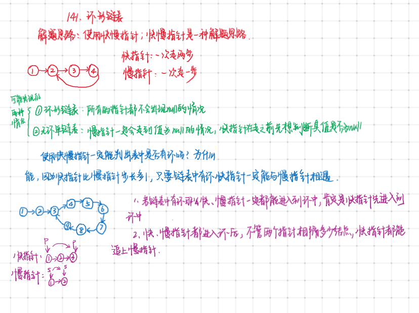

#### 算法思路


```javascript
/**
 * Definition for singly-linked list.
 * function ListNode(val) {
 *     this.val = val;
 *     this.next = null;
 * }
 */

/**
 * @param {ListNode} head
 * @return {boolean}
 */
/* 
 * 这个题给出一个链表，判断一下是否有环
 * 
 */
var hasCycle = function (head) {
    var path = 0; // 记录步长
    // 快慢指针
    var slow_ptr = head;
    var fast_ptr = head;
    while (1) {
        path = 0;
        if(slow_ptr == null) return false; //链表一定没有环
        slow_ptr = slow_ptr.next;
        while (path < 2) {
            if(fast_ptr == null) return false; // 链表一定没有环
            fast_ptr = fast_ptr.next;
            path++;
        }
        if(slow_ptr == fast_ptr){
            //快慢指针相遇，说明有环
            return true;
        }
    }
};
```
