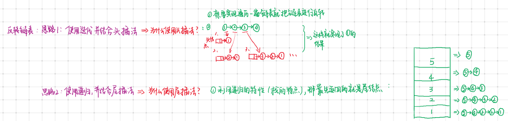

## 图解



#### 方式一：使用迭代：设置头结点
```javascript
/**
 * Definition for singly-linked list.
 * function ListNode(val, next) {
 *     this.val = (val===undefined ? 0 : val)
 *     this.next = (next===undefined ? null : next)
 * }
 */
/**
 * @param {ListNode} head
 * @return {ListNode}
 */
/* 
 * 思路一：重新创建一个链表使用头结点，头插法
 * 
 */
var reverseList = function(head) {
    var reverseHead = new ListNode();
    var ptrForReverse = null;
    var ptrForOld = head;
    head = head == null?null:head.next; // 这样做是为了防止结点个数为0时报错
    while(ptrForOld){
        if(reverseHead.next == null){
            // 第一次
            reverseHead.next = ptrForOld;
            ptrForReverse = reverseHead.next;
            ptrForReverse.next = null;
        }else{
            ptrForOld.next = ptrForReverse;
            reverseHead.next = ptrForOld;
        }
        ptrForReverse = reverseHead.next;
        ptrForOld = head;
        head = head == null?null:head.next;// 这样做是为了防止ptrForOld指向最后一个结点时，head为null报错
    }
    return ptrForReverse;
};
```
#### 方式二：使用递归，使用尾插法

```javascript
/* 
 * 思路二：递归法：重新创建一个链表，尾插法
 * 
 */
var reverseList = function(head) {
    var reversePtr = null;
    var reverseHead = null;
    function recursion(head){
    if(!head){
        // 到达尾结点
        return;
    }
    recursion(head.next);
    // 判断是否是尾结点
    if(!head.next){
        reverseHead = head;
        reversePtr = head;
    }else{
        reversePtr.next = head;
        reversePtr = reversePtr.next;
    }
    reversePtr.next = null;

}
    recursion(head);
    return reverseHead;
};

```
